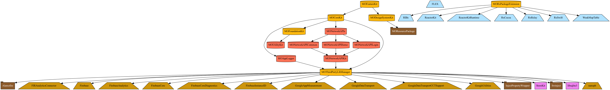
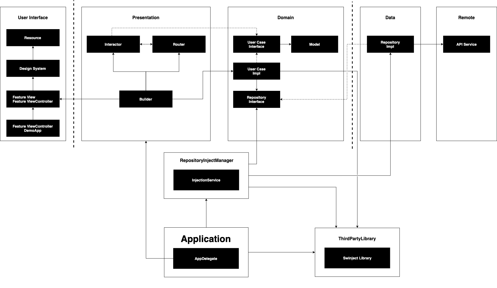

# iOSApplicationTemplate

이 프로젝트는 Tuist를 이용하여 각 프로젝트를 모듈로 구성하는 형태입니다.

## 사용법

1. Install tuist

   `bash <(curl -Ls https://install.tuist.io)`

2. Run Tuist dependencies - (Optional, default installed SDK, path : ${Repository}/Libraries)

    ```
    $ tuist dependencies fetch

    # PinLayout에서 해당 폴더를 빌드하기 때문에 에러 발생하여, TestProjects를 삭제하고 Carthage를 이용하여 PinLayout를 빌드함.
    $ rm -rf Tuist/Dependencies/Carthage/Checkouts/PinLayout/TestProjects
    $ carthage build PinLayout --project-directory Tuist/Dependencies --platform iOS --use-xcframeworks --no-use-binaries --use-netrc --cache-builds --verbose

    # ReactorKit 프로젝트는 carthage를 지원이 잘 안되므로 다음과 같이 수행.
    $ (cd Tuist/Dependencies/Carthage/Build && rm .ReactorKit.version .WeakMapTable.version) # 생성 기록 삭제
    $ (cd Tuist/Dependencies/Carthage/Checkouts/ReactorKit && swift package generate-xcodeproj) # ReactorKit 프로젝트 생성
    $ (cd Tuist/Dependencies/Carthage/Checkouts/WeakMapTable && swift package generate-xcodeproj) # WeakMapTable 프로젝트 생성
    $ tuist dependencies fetch # Carthage 빌드

    # RIBs 프로젝트의 RxSwift, RxRelay 의존성이 framework로 되어 있으므로, xcframework로 교체함.
    $ open Tuist/Dependencies/Carthage/Checkouts/RIBs/ios/RIBs.xcodeproj
    $ carthage build RIBs --project-directory Tuist/Dependencies --platform iOS --use-xcframeworks --no-use-binaries --use-netrc --cache-builds --verbose


    # 계속 서드파티 라이브러리를 빌드함.
    $ tuist dependencies fetch
    ```

3. Run tuist generate

   `tuist generate`

4. Open workspace

   `open App.xcworkspace`

5. Run tuist scaffold

   `tuist scaffold framework --name UtilityKit -p Projects/Modules/Foundation`

## Dependency Graph

Tuist를 이용하여 Dependency Graph를 출력할 수 있음.

```
$ tuist graph # Graph 생성
$ tuist graph -t # 테스트 타겟 제외
$ tuist graph -d # 외부 라이브러리 제외
$ tuist graph -t -f dot # dot 파일로 출력

# Tests, Testing, Example 타겟을 제외한 그래프 생성
$ ./script/generate_tuist_graph.sh.sh
```



## Tuist

### Reference

* **[tuist/awesome-tuist](https://github.com/tuist/awesome-tuist)**
* **[HedvigInsurance/ugglan](https://github.com/HedvigInsurance/ugglan)**
* [JulianAlonso/MarvelApp](https://github.com/JulianAlonso/MarvelApp)
* https://sarunw.com/tags/tuist/
* [BendingSpoons/tempura-swift](https://github.com/BendingSpoons/tempura-swift)
* [fortmarek/ComposableTuistArchitecture](https://github.com/fortmarek/ComposableTuistArchitecture)
* [ronanociosoig/tuist-pokedex](https://github.com/ronanociosoig/tuist-pokedex)
* [nimblehq/ios-templates](https://github.com/nimblehq/ios-templates)

## Clean Architecture With Swinject, RIBs



* 클린아키텍처 일부 설계 참고
  * https://github.com/kudoleh/iOS-Clean-Architecture-MVVM.git
  * https://medium.com/@kimtaesoo188/android-clean-architecture-2e789d6cefc6, https://miro.medium.com/max/22442/1*FRgFgSG2mu4nRPyhwsPn3Q.png
  * https://youngest-programming.tistory.com/484
  * https://develogs.tistory.com/7
  * [Clean Architecture is not Domain-Data-Presentation.](https://markonovakovic.medium.com/clean-architecture-is-not-domain-data-presentation-e368d7ff8579)

## Design System

### 시험할 라이브러리 목록
- [layoutBox/FlexLayout](https://github.com/layoutBox/FlexLayout)
- SwiftUI
- [Doric](https://github.com/jayeshk/Doric)
- [alexdrone/Render](https://github.com/alexdrone/Render)

### 디자인시스템 Ref
- https://medium.com/sketch-app-sources/setting-up-a-design-system-8729510def93
- https://ux.mailchimp.com/patterns/color
- https://brennobemoura.medium.com/implementing-a-design-system-compatible-with-uikit-and-swiftui-1c6da34814f0
- [W3.org 디자인 패턴 및 위젯](https://www.w3.org/TR/wai-aria-practices-1.1/)

### FlexLayout 사용법 참고
  * https://medium.com/swlh/a-swift-yogakit-guide-to-flexbox-fec74e1bffaf
  * https://www.raywenderlich.com/530-yoga-tutorial-using-a-cross-platform-layout-engine
  * https://yogalayout.com/

## Navigation

- Github : [justeat/NavigationEngineDemo](https://github.com/justeat/NavigationEngineDemo), Article https://tech.justeattakeaway.com/2019/04/16/deep-linking-at-scale-on-ios/

## 사용한, 사용할 기타 오픈소스
* [RxViewBinder](https://github.com/magi82/RxViewBinder)
* [PureSwiftUI](https://github.com/CodeSlicing/pure-swift-ui)
* [TouchVisualizer](https://github.com/morizotter/TouchVisualizer)

## Firebase

* [firebase/quickstart-ios](https://github.com/firebase/quickstart-ios)
