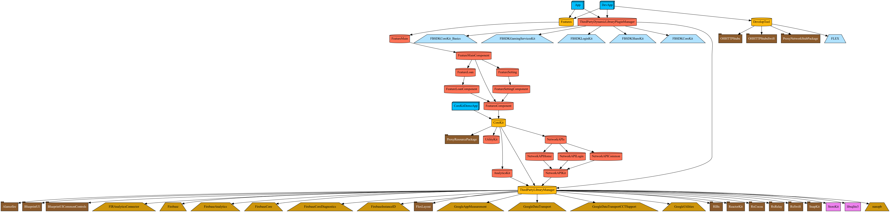

# iOSApplicationTemplate

이 프로젝트는 Tuist를 이용하여 각 프로젝트를 모듈로 구성하는 형태입니다.

## 사용법

1.[Tuist 설치](https://github.com/tuist/tuist) - 버전 1.43.0 이상

2.[Carthage 설치](https://github.com/Carthage/Carthage) - 버전 0.38.0 이상  

3.`tuist dependencies`를 실행하여 XCFramework 생성

```
$ tuist dependencies fetch
Resolving and fetching dependencies.
Resolving and fetching Carthage dependencies.
...
Carthage dependencies resolved and fetched successfully.
Dependencies resolved and fetched successfully.
```

3.1. RxBlocking, RxTest를 Test 타겟에서 사용하기 위해 `install_name_tool`을 이용하여 `@rpath/RxSwift.framework/RxSwift`를 `@rpath/ThirdPartyLibraryManager.framework/ThirdPartyLibraryManager`로 교체함.

```
$ sh script/change-rpath-library.sh
```

4.`tuist generate`를 실행하여 프로젝트 파일 생성
```
$ tuist generate
```

## Dependency Graph

Tuist를 이용하여 Dependency Graph를 출력할 수 있음.

```
# Graph 생성
$ tuist graph

# 테스트 타겟 제외
$ tuist graph -t

# 외부 라이브러리 제외
$ tuist graph -d

# dot 파일로 출력
$ tuist graph -t -f dot
```



## Design System

1.시험 라이브러리 목록
- [Square/Blueprint](https://github.com/square/Blueprint)
- [layoutBox/FlexLayout](https://github.com/layoutBox/FlexLayout)
- SwiftUI